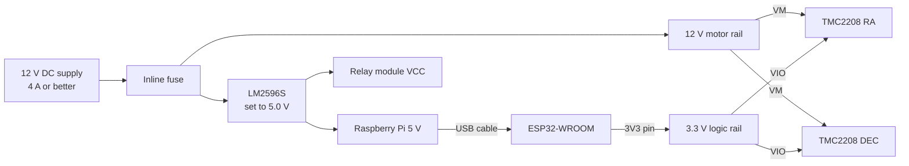
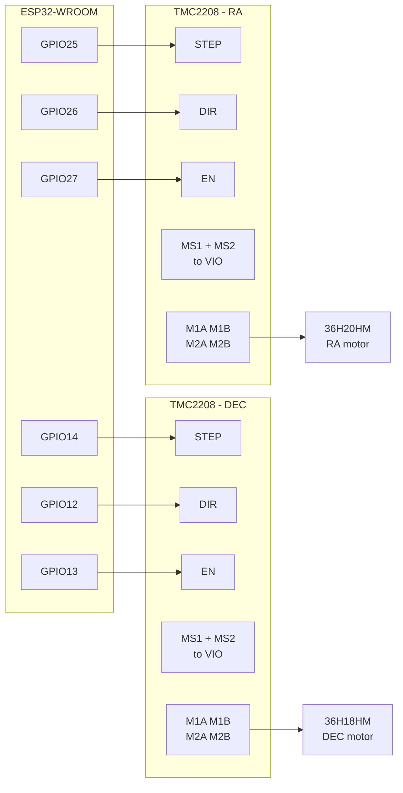

# Hardware

The parts on hand and how they wire into the mount. Pin numbers here match the firmware
constants in [esp32/firmware/src/main.cpp](esp32/firmware/src/main.cpp) and the mount defaults in
[backend/api/app.py](backend/api/app.py); change one and change the others.

## Inventory

| Part | What it is | Role here |
| --- | --- | --- |
| ESP32-WROOM | 3.3 V MCU module | Motion controller. The firmware targets `esp32dev`. |
| TMC2208 driver modules | Stepper drivers, step/dir interface | One per axis, RA and DEC. |
| 36H20HM stepper | 36 mm frame (NEMA 14) hybrid, 20 mm body | Larger of the two axes, normally RA. |
| 36H18HM stepper | 36 mm frame (NEMA 14) hybrid, 18 mm body | Second axis, normally DEC. |
| KP35FM2 stepper | 35 mm frame stepper | Spare, or a third axis such as focus. |
| LM2596S modules | Adjustable buck converters, non-isolated | Derive 5 V logic from the 12 V motor rail. |
| Relay modules | Opto-isolated relay boards | Switching dew heater, camera, or the motor rail. |
| Amica NodeMCU | ESP8266 board, 3.3 V | Not used by the current firmware. See [Spare NodeMCU](#spare-nodemcu). |

Note the TMC2208 is a stepper driver, not a servo driver, despite how these modules are often
listed. It has no position feedback; the mount is open loop.

### Confirm on the motor labels first

The three motors are the one thing here that cannot be pinned down from a part number alone, and
both numbers below decide settings you have to enter by hand. Read them off the label or the
supplier page before wiring:

| Value | Why it matters |
| --- | --- |
| Rated current per phase (A) | Sets the driver `Vref`. Guessing this cooks the motor or loses steps. |
| Step angle (1.8° or 0.9°) | Sets steps per revolution. 1.8° is 200 full steps, 0.9° is 400. |
| Phase resistance / rated voltage | Should stay under about 4 V phase voltage for the TMC2208 to drive well. |
| Wire count | 4 wires is bipolar and works directly. 6 or 8 wires needs the right pairs picked. |

Identify the coil pairs with a multimeter: the two wires that read a few ohms to each other are one
coil, and there is no continuity between coils. One coil goes to `M1A`/`M1B`, the other to
`M2A`/`M2B`.

## Power



Set each LM2596S output with a meter **before** connecting anything to it. They ship at an arbitrary
voltage and a few turns of the pot is the difference between 5 V and 30 V into a Pi.

These are 3 A parts on paper and closer to 2 A in still air. A Pi 4 or 5 under load plus a camera
will brown out on a bare LM2596S, so either heatsink it and keep the input voltage low to reduce
the drop, or power the Pi from its own supply and use the buck only for the relay board and any
accessories. Undervolting a Pi shows up as random corruption long before it shows up as a reboot.

The ESP32 is powered over the same USB cable that carries its serial link to the Pi, so it does not
need a rail of its own. Take driver `VIO` from the ESP32 `3V3` pin so the logic reference is the
same one driving `STEP`/`DIR`. Every ground in the system must be common: motor supply, buck
outputs, ESP32, and Pi.

## Signal wiring



| Signal | ESP32 pin | Firmware constant |
| --- | --- | --- |
| RA STEP | GPIO25 | `RA_STEP` |
| RA DIR | GPIO26 | `RA_DIR` |
| RA ENABLE | GPIO27 | `RA_ENABLE` |
| DEC STEP | GPIO14 | `DEC_STEP` |
| DEC DIR | GPIO12 | `DEC_DIR` |
| DEC ENABLE | GPIO13 | `DEC_ENABLE` |

Pins are changeable at runtime without reflashing, from the Mount panel in the UI or with
`configure 25 26 27 14 12 13 1` over serial. The values persist in ESP32 NVS.

**GPIO12 is a strapping pin.** On the ESP32 it selects the flash voltage at reset, and a
WROOM module with 3.3 V flash will fail to boot if GPIO12 is held high while it comes out of reset.
A TMC2208 `DIR` input alone will not pull it up, so the default wiring is fine, but do not add a
pull-up on that line, and if you ever put a level shifter or relay board on it, move DEC DIR to a
free pin instead. GPIO13, 14, 25, 26 and 27 have no such restriction.

## TMC2208 configuration

`EN` is active low: pulled to GND the outputs are on, at `VIO` they are off. That matches the
`enable_active_low` default of `true`, and it means the motors are released whenever the ESP32 is
in reset or unpowered.

**Microstepping.** Tie both `MS1` and `MS2` to `VIO` for 1/16 stealthChop. With 1.8° motors that is
200 × 16 = **3200 steps per revolution**, which is the `ra_steps_per_revolution` default. Leaving
the pins floating gives 1/8 instead and every slew lands at half the commanded angle.

| MS1 | MS2 | Microstep |
| --- | --- | --- |
| GND | GND | 1/8 |
| GND | VIO | 1/2 |
| VIO | GND | 1/4 |
| VIO | VIO | 1/16 |

If your motors turn out to be 0.9°, set steps per revolution to 6400 rather than rewiring.

**Current.** Set it by measuring the voltage on the `Vref` pad against GND and turning the pot:

```
Vref = I_rms × 1.41
```

Start at half the motor's rated current and raise it in 0.1 A steps only if you lose steps. A
motor rated 1.0 A per phase starts around 0.5 A rms, so `Vref` ≈ 0.71 V. The module tops out at
1.64 A rms, and anything above roughly 0.85 A rms wants a heatsink and moving air. Small NEMA 14
motors on a mount draw far less than that, so err low: a tracking mount spends its life at low
speed where torque is cheap, and a cooler driver drifts less.

**Direction is inverted** on TMC2xxx modules compared with A4988 and friends. If an axis runs
backwards, flip it in software or rotate the motor connector 180°, not by rewiring one coil wire.

**Power sequencing matters** on modules with 3–5 V `VIO`, because the chip's internal logic runs off
`VM`. Bring `VM` up before `VIO` and drop `VIO` before `VM`. Since `VIO` here comes from the ESP32,
which is USB powered, that means the 12 V rail should already be on before you plug in the Pi's USB
cable, or fit a schottky diode from `VIO` anode to `VM` cathode and stop worrying about it.

**Never disconnect a motor or cut the motor supply while an axis is moving.** Back EMF from a
spinning motor into an unpowered driver is the most common way these fail. Stop first, then power
down. The `stop` and `disable` commands set `EN` high, which frees the motors immediately, so wire
any emergency stop to pull both `EN` lines to `VIO` rather than cutting `VM`.

Add a large electrolytic capacitor, 100 µF or more, across `VM` and GND close to each driver.

## Relay modules

Useful for a dew heater, camera power, or killing the motor rail from software. Two things bite:

- Most of these boards are 5 V. Driving the input from a 3.3 V ESP32 pin is marginal on the
  opto-coupler and can leave a relay that never quite releases. Check yours switches reliably at
  3.3 V, or drive it through a small transistor.
- If the board has a `JD-VCC` jumper, that jumper is the only thing isolating the coil supply from
  your logic supply. Removing it and feeding `JD-VCC` from the 5 V buck while `VCC` stays on the
  ESP32 rail is the point of the opto-couplers.

Relay boards are active low as often as not. Confirm which way yours goes before wiring anything
that matters, so a reboot does not switch the dew heater on unattended.

## Spare NodeMCU

The ESP8266 has no role in the current design: the firmware in this repo builds for `esp32dev` and
talks to the Pi over USB serial.

There is a wireless path if you want one. The API publishes every mount command as JSON to the MQTT
topic `telescope/mount/command`, alongside the serial write, so a NodeMCU subscribed to that topic
could drive the drivers over Wi-Fi instead. That firmware does not exist yet; the ESP8266 also has
fewer usable GPIOs and several that must be at a particular level at boot, so the ESP32 is the
better host for six motor signals. Keep the NodeMCU for a separate sensor node reporting
temperature or dew point.

## Before the first power-up

1. Set both LM2596S outputs with a meter, disconnected from any load.
2. Confirm all grounds are common.
3. Set `Vref` on both drivers with the motors disconnected and `VM` applied.
4. Tie `MS1` and `MS2` to `VIO` on both drivers.
5. Check GPIO12 is not pulled high, then confirm the ESP32 boots and answers `status`.
6. Test each axis off the telescope, with `enable` then a short `move`, and confirm direction.
7. Only then mount the motors.
