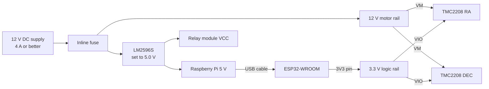
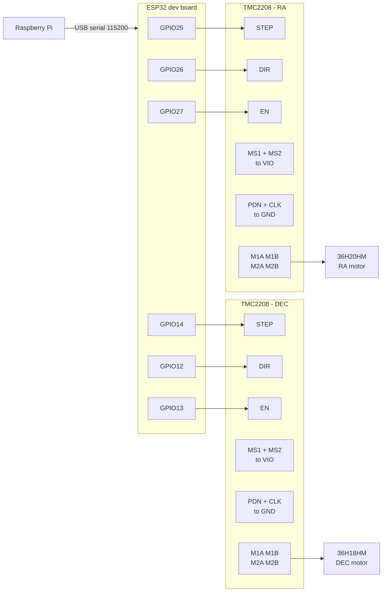

# Hardware

The parts on hand and how they wire into the mount. Pin numbers here match the firmware
constants in [esp32/firmware/src/main.cpp](esp32/firmware/src/main.cpp) and the mount defaults in
[backend/api/app.py](backend/api/app.py); change one and change the others.

## Inventory

| Part | What it is | Role here |
| --- | --- | --- |
| ESP32-WROOM | 3.3 V MCU module | Motion controller. The firmware targets `esp32dev`. |
| TMC2208 driver modules | Stepper drivers, step/dir interface | One per axis, RA and DEC. |
| 36H20HM stepper | 0.9°, 0.5 A/phase, 12 Ω, 1100 g·cm | RA axis. |
| 36H18HM stepper | 36 mm frame (NEMA 14) hybrid, 18 mm body | DEC axis. Specs still unconfirmed. |
| KP35FM2 stepper | 1.8°, 0.6 A/phase, 37 Ω, 700 g·cm | Focuser only, see [Rail voltage](#rail-voltage). |
| LM2596S modules | Adjustable buck converters, non-isolated | Derive 5 V logic from the 12 V motor rail. |
| Relay modules | Opto-isolated relay boards | Switching dew heater, camera, or the motor rail. |
| Amica NodeMCU | ESP8266 board, 3.3 V | Not used by the current firmware. See [Spare NodeMCU](#spare-nodemcu). |

Note the TMC2208 is a stepper driver, not a servo driver, despite how these modules are often
listed. It has no position feedback; the mount is open loop.

### Motor specifications

| | KP35FM2-035 | 36H20HM-0504A | 36H18HM |
| --- | --- | --- | --- |
| Step angle | 1.8° (200/rev) | 0.9° (400/rev) | unconfirmed |
| Rated current per phase | 0.6 A | 0.5 A | unconfirmed |
| Phase resistance | 37 Ω | 12 Ω | unconfirmed |
| Phase inductance | not published | 9 mH | unconfirmed |
| Holding torque | 700 g·cm (0.069 N·m) | 1100 g·cm (0.108 N·m) | unconfirmed |
| Steps per rev at 1/16 | 3200 | **6400** | |
| Rail needed for rated current | 22.2 V | 6.0 V | |

The 36BYGH datasheet lists its columns as *Inductance* then *Resistance*, but the units row beneath
reads Ω then mH. The units row is the correct one: 0.5 A × 12 Ω = 6.0 V, which is exactly the
quoted rated voltage, whereas 9 Ω would give 4.5 V.

Identify the coil pairs with a multimeter, which also tells the motors apart: ~12 Ω within a pair is
the 36H20HM, ~37 Ω is the KP35FM2, and between coils there is no continuity. One coil goes to
`M1A`/`M1B`, the other to `M2A`/`M2B`. The KP35FM2 datasheet gives them outright: blue/red is phase
one, yellow/white is phase two.

## Power



Set each LM2596S output with a meter **before** connecting anything to it. They ship at an arbitrary
voltage and a few turns of the pot is the difference between 5 V and 30 V into a Pi.

These are 3 A parts on paper and closer to 2 A in still air. Any Pi under load plus a camera can
brown out a bare LM2596S, and an older board is not the safe case: a Pi 3B peaks at 1.34 A under
stress, slightly more than a Pi 4B's 1.25 A. So either heatsink the buck and keep the input voltage
low to reduce the drop, or power the Pi from its own supply and use the buck only for the relay
board and any accessories. Undervolting a Pi shows up as random corruption long before it shows up
as a reboot: the detector trips at 4.63 V, so set the buck to about 5.1 V rather than 5.0 V to leave
margin for the LM2596S's slow response to load steps.

The ESP32 is powered over the same USB cable that carries its serial link to the Pi, so it does not
need a rail of its own. Take driver `VIO` from the ESP32 `3V3` pin so the logic reference is the
same one driving `STEP`/`DIR`. Every ground in the system must be common: motor supply, buck
outputs, ESP32, and Pi.

## Signal wiring



| Signal | ESP32 pin | Firmware constant |
| --- | --- | --- |
| RA STEP | GPIO25 | `RA_STEP` |
| RA DIR | GPIO26 | `RA_DIR` |
| RA ENABLE | GPIO27 | `RA_ENABLE` |
| DEC STEP | GPIO14 | `DEC_STEP` |
| DEC DIR | GPIO12 | `DEC_DIR` |
| DEC ENABLE | GPIO13 | `DEC_ENABLE` |

The remaining driver pins are tied off rather than driven:

| Driver pin | Goes to |
| --- | --- |
| `MS1`, `MS2` | `VIO`, selecting 1/16 |
| `PDN` | `GND`, enabling standstill current reduction |
| `CLK` | `GND`, selecting the internal oscillator |
| `NC` | nothing |

Pins are changeable at runtime without reflashing, from the Mount panel in the UI or with
`configure 25 26 27 14 12 13 1` over serial. The values persist in ESP32 NVS.

**GPIO12 is a strapping pin.** On the ESP32 it selects the flash voltage at reset, and a
WROOM module with 3.3 V flash will fail to boot if GPIO12 is held high while it comes out of reset.
A TMC2208 `DIR` input alone will not pull it up, so the default wiring is fine, but do not add a
pull-up on that line, and if you ever put a level shifter or relay board on it, move DEC DIR to a
free pin instead. GPIO13, 14, 25, 26 and 27 have no such restriction.

## TMC2208 configuration

### Module pinout

The boards are FYSETC TMC2208 V1.0, 8 pins per side straddling the current trimmer:

| Left side | Right side |
| --- | --- |
| `GND` | `DIR` |
| `VIO` | `STEP` |
| `M2B` | `CLK` |
| `M2A` | `PDN` |
| `M1A` | `NC` |
| `M1B` | `MS2` |
| `GND` | `MS1` |
| `VM` | `EN` |

Read that top to bottom with the silkscreen upright. Vendor wiring diagrams for this module are
often drawn rotated 180°, which puts `VM` at the top and reverses both columns, so match pins by
name and never by position on the header.

Two things are easy to get wrong:

- **There are two `GND` pins**, one beside `VIO` at the logic end and one beside `VM` at the power
  end. They are the same net, but use the power-end one for the supply return and the logic-end one
  for the ESP32 ground so the motor current does not share a path with the signal ground.
- **The coil pairs are `M2B`+`M2A` and `M1A`+`M1B`.** In that physical order the middle two pins are
  `M2A` and `M1A`, which sit next to each other and are both "A" but belong to *different* coils.
  Pairing those two is the classic mistake: the motor buzzes, heats and does not turn.

`VM` sits at a board corner, so it is the pin to check first if the driver is dead — a supply wire
landing one position off puts 12 V onto `M1B`.

`EN` is active low: pulled to GND the outputs are on, at `VIO` they are off. That matches the
`enable_active_low` default of `true`. It does not on its own mean the motors are released while the
MCU is in reset, though: an unconfigured GPIO is an input, so the line floats at whatever the module
leaves it at. Fit a 10 kΩ pull-up from `EN` to `VIO` so the coils stay off until firmware has run,
and buzz your own module out rather than assuming it has one.

**Tying `EN` straight to `GND`** is a legitimate shortcut, and it frees a GPIO per axis, which
matters on an ESP8266. The cost is that the coils are energised the moment `VM` and `VIO` come up,
the Enable and Disable buttons stop doing anything, and there is no line left to pull high for an
emergency release. A motor that feels stiff with no firmware running is this, not a working driver.
If you want the pin back but keep the release, tie both `EN` lines to one GPIO instead: five signals
rather than six, and a single command still frees both axes.

**Microstepping.** Tie both `MS1` and `MS2` to `VIO` for 1/16 stealthChop. Both pins have
pull-downs, so leaving them floating gives 1/8 instead and every move lands at half the commanded
angle.

| MS1 | MS2 | Microstep |
| --- | --- | --- |
| GND | GND | 1/8 |
| GND | VIO | 1/2 |
| VIO | GND | 1/4 |
| VIO | VIO | 1/16 |

The 36H motors are 0.9°, so 400 × 16 = **6400 steps per revolution**. Set
`ra_steps_per_revolution` and `dec_steps_per_revolution` to 6400 rather than the 3200 default, which
assumes a 1.8° motor. The KP35FM2 is the 1.8° one at 3200.

**Current.** Measure the voltage on the `Vref` pad against GND and turn the pot:

```
Vref = I_rms × 1.41
```

That formula is for Watterott SilentStepSticks and depends on the board's sense resistors, which
differ between clones. On a third-party module treat it as an estimate: set `Vref` low, around
0.2 V, confirm the axis moves, and raise it only if you lose steps.

Heat rises with the square of current while torque rises only linearly, and gearing leaves torque in
hand, so err low. For the 36H20HM:

| Vref | Current | Both phases | Axis torque at 144:1 |
| --- | --- | --- | --- |
| 0.71 V | 0.5 A (rated) | 6.0 W, 80 °C rise | 10.9 N·m |
| 0.35 V | 0.25 A | 1.5 W | 5.4 N·m |
| 0.21 V | 0.15 A | 0.54 W | 3.3 N·m |

The datasheet's 80 °C rise is quoted *at* rated current with both phases on, so 0.5 A is the
runs-very-hot case by design rather than a target.

The modules ship with a stick-on heatsink. At a quarter amp it is not needed — the driver only
starts to want one above roughly 0.85 A rms — but fit it anyway if the electronics end up in a
sealed box, since a cooler driver drifts less between the Vref you set and the current it delivers.

**Standstill current.** `PDN` low enables automatic power down, halving the current after about a
second without step pulses. It will not engage while tracking, because at 144:1 the mount steps
roughly every 90 ms and the driver never sees a standstill; it only helps a parked mount. `PDN` is
also the UART pin, so tying it to GND gives up UART configuration. Run it to a spare ESP32 pin
instead if you may want spreadCycle for faster slews later.

### Rail voltage

A stepper's rated voltage is not a supply voltage. It is `I_rated × R`, the voltage a constant
voltage drive would need to reach rated current, and a current-regulating driver is deliberately fed
several times more so current can rise into the coil inductance as the motor turns. Run a motor at
exactly its rated voltage and the corner speed is zero: it can hold position and nothing else.

12 V suits the 36H pair. It gives 2× headroom over the 6.0 V they need for rated current and an
electrical ceiling near 23,500 steps/s, far above the 1 kHz the firmware currently uses. 24 V would
roughly double that ceiling, at the cost of more heat in the driver's internal regulator and a much
hotter buck feeding the Pi. It buys top speed, not torque.

The KP35FM2 is the exception, and the reason it is a focuser here. At 37 Ω it needs 22.2 V just to
reach rated current, so on 12 V it is capped at 12/37 = 0.32 A and about 54% of its torque. Proper
headroom would want roughly 44 V, past the TMC2208's 35 V limit. (Vendor art for these modules
prints the `VM` range as 5.5–36 V; 36 V is the absolute maximum, and 35 V is the working limit. Both
are academic at 12 V.)

One rail feeds both drivers. Current is set per driver at its own pot, so motors with different
ratings share a supply without trouble.

**Direction is inverted** on TMC2xxx modules compared with A4988 and friends. If an axis runs
backwards, flip it in software or rotate the motor connector 180°, not by rewiring one coil wire.

**Power sequencing matters** on modules with 3–5 V `VIO`, because the chip's internal logic runs off
`VM`. Bring `VM` up before `VIO` and drop `VIO` before `VM`. Since `VIO` here comes from the ESP32,
which is USB powered, that means the 12 V rail should already be on before you plug in the Pi's USB
cable, or fit a schottky diode from `VIO` anode to `VM` cathode and stop worrying about it.

**Never disconnect a motor or cut the motor supply while an axis is moving.** Back EMF from a
spinning motor into an unpowered driver is the most common way these fail. Stop first, then power
down. The `stop` and `disable` commands set `EN` high, which frees the motors immediately, so wire
any emergency stop to pull both `EN` lines to `VIO` rather than cutting `VM`.

Add a large electrolytic capacitor, 100 µF or more, across `VM` and GND close to each driver.

## Relay modules

Useful for a dew heater, camera power, or killing the motor rail from software. Two things bite:

- Most of these boards are 5 V. Driving the input from a 3.3 V ESP32 pin is marginal on the
  opto-coupler and can leave a relay that never quite releases. Check yours switches reliably at
  3.3 V, or drive it through a small transistor.
- If the board has a `JD-VCC` jumper, that jumper is the only thing isolating the coil supply from
  your logic supply. Removing it and feeding `JD-VCC` from the 5 V buck while `VCC` stays on the
  ESP32 rail is the point of the opto-couplers.

Relay boards are active low as often as not. Confirm which way yours goes before wiring anything
that matters, so a reboot does not switch the dew heater on unattended.

## NodeMCU as the controller

The Amica NodeMCU is an ESP8266, and since the firmware gained a `nodemcuv2` environment it can host
the mount instead of the ESP32. Note that ESP32 dev boards are commonly sold as "ESP32 NodeMCU" as
well, and the board in the diagrams above is that ESP32, not this one. The GPIO numbering differs,
so the defaults differ: RA `5/4/16` and DEC `14/12/13`, which is D1/D2/D0 and D5/D6/D7 on the
silkscreen. The UI fields take the GPIO number, never the `D` label.

Pins are the binding constraint. Exclude GPIO6-11 for the SPI flash and GPIO1/3 for the USB console,
then leave alone the pins that must hold a level at reset — D8/GPIO15 low, D3/GPIO0 and D4/GPIO2
high — and what remains is D0, D1, D2, D5, D6 and D7. Exactly six signals with nothing spare.
Grounding both `EN` lines, or tying them to a single GPIO, buys back the headroom.

GPIO16/D0 is the odd one out: it lives in the RTC domain, toggles more slowly than the others, and
has a pull-down where the rest have pull-ups. Use it for `ENABLE` rather than `STEP`, and pull it up
to `VIO` externally, or an active-low `EN` sitting there energises the coils at power-up.

There is a wireless path if you want one. The API publishes every mount command as JSON to the MQTT
topic `telescope/mount/command`, alongside the serial write, so a NodeMCU subscribed to that topic
could drive the drivers over Wi-Fi instead. That firmware does not exist yet.

## Before the first power-up

1. Set both LM2596S outputs with a meter, disconnected from any load.
2. Confirm all grounds are common.
3. Set `Vref` on both drivers with the motors disconnected and `VM` applied.
4. Tie `MS1` and `MS2` to `VIO` on both drivers.
5. Check the strapping pins for your board are free: GPIO12 on an ESP32, D8/GPIO15 held low and
   D3/GPIO0 and D4/GPIO2 held high on a NodeMCU. Then confirm the board boots and answers `status`.
6. Confirm `EN` idles high, so the motors are free before firmware runs, unless you have
   deliberately grounded it.
7. Test each axis off the telescope, with `enable` then a short `move`, and confirm direction.
8. Only then mount the motors.
